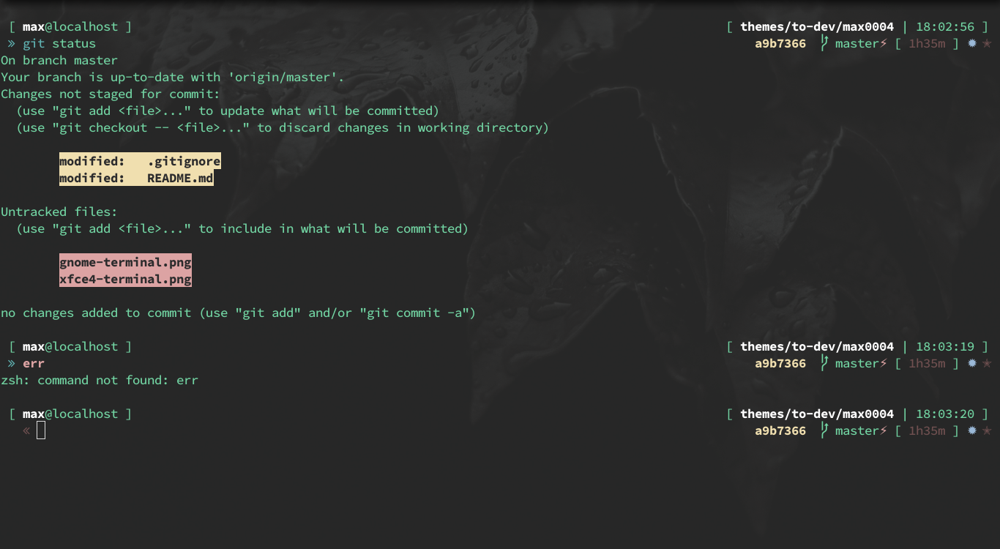
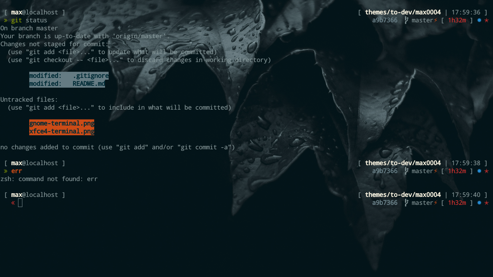

# max0004 ZSH prompt theme

Custom oh-my-zsh prompt [theme](https://github.com/max-devjs/max0004), evolution 
of my previous [max0003](https://github.com/max-devjs/max0003) , and based on:

- [smt](https://github.com/robbyrussell/oh-my-zsh/wiki/themes#smt) by Stephen 
Tudor ([stephen@tudorstudio.com](stephen@tudorstudio.com))
- original [bureau](https://github.com/robbyrussell/oh-my-zsh/wiki/themes#bureau) 
theme for oh-my-zsh by isqua ([isqua@isqua.ru](isqua@isqua.ru))

## Screenshots

Xfce4 terminal:

* custom palette
* font: Hasklig 13

Gnome terminal:

* system color palette
* scheme: solarized dark built
* font: Droid Sans Mono for Powerline Regular 13

Hint: also the new [bureau](https://github.com/isqua/bureau) prompt is an 
interesting one.

## Prompt features

Basically, I borrowed and adapted the first line from bureau and the second 
line from smt.

### First line
It shows on the left:

* user name,
* host name.

On the right:

* current path ( %3 ),
* current time.

### Second line
It shows on the left:

* prompt char (  or , visible in screenshot ):
  * green  char if the previous command returned 
  successfully,
  * red  char otherwise.

On the right:

* git infos:
  * current short sha,
  * git prompt info:
    * current git branch, called master and
    * dirty in screenshot ( ⚡ )
  * git time since last commit,
  * added, modified, staged, unstaged, etc status:
    * ✹ modified and
    * ✭ untracked in screenshot

## Usage

Check oh-my-zsh [themes documentation](https://github.com/robbyrussell/oh-my-zsh/wiki/themes) 
about using themes. To make it easy:

* just drop the max0004.zsh-theme file in the themes/ directory in your 
oh-my-zsh distribution and
* in order to enable it, set ZSH_THEME to the name of the theme 
( ZSH_THEME="max0004" ) in your ~/.zshrc ( or in a configuration file loaded by 
.zshrc ).